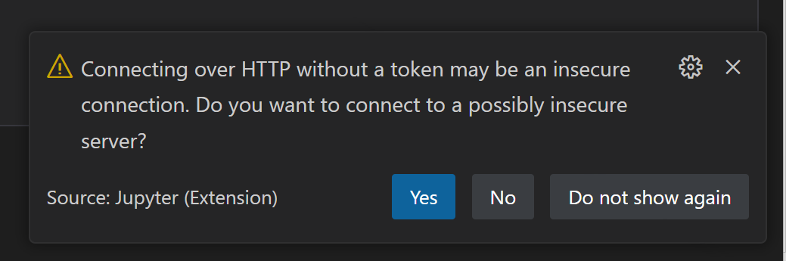
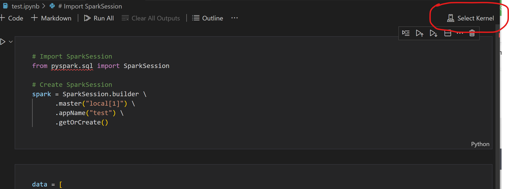
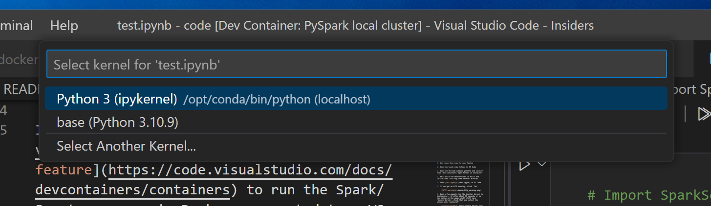
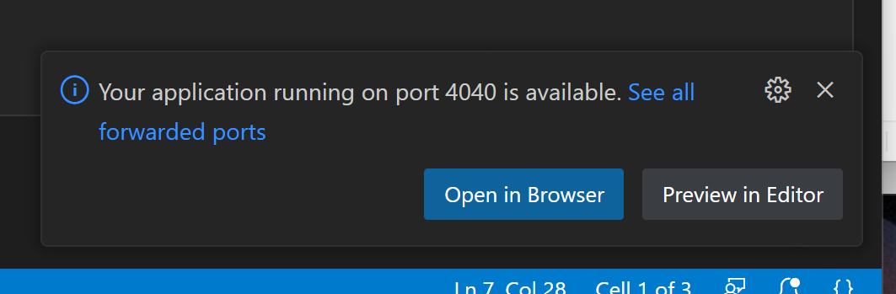
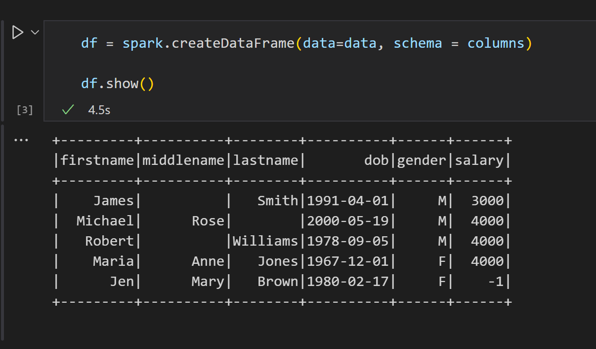

# Local PySpark dev environment

This repo provides everything needed for a self-contained, local PySpark 1-node "cluster" running on your laptop, including a Jupyter notebook environment.

It uses [Visual Studio Code](https://code.visualstudio.com/) and the [devcontainer feature](https://code.visualstudio.com/docs/devcontainers/containers) to run the Spark/Jupyter server in Docker, connected to a VS Code dev environment frontend.

## Requirements

- Install [Docker Desktop](https://www.docker.com/products/docker-desktop/) (you don't have to be a Docker super-expert :-))

- Install [Visual Studio Code](https://code.visualstudio.com/download)

- Install the [VS Code Remote Development pack](https://marketplace.visualstudio.com/items?itemName=ms-vscode-remote.vscode-remote-extensionpack)

## Setup

1. Install required tools 

1. Git clone this repo to your laptop

1. Open the local repo folder in VS Code

1. Open the [VS Code command palette](https://code.visualstudio.com/docs/getstarted/userinterface#_command-palette) and select/type 'Reopen in Container'

1. Wait while the devcontainer is built and initialized, this may take several minutes

1. Open [test.ipynb](./test.ipynb) in VS Code

1. If you get an HTTP warning, click 'Yes'

    

1. Wait a few moments for the Jupyter kernel to initialize... if after about 30 seconds or so the button on the upper-right still says 'Select Kernel', click that and select the option with 'ipykernel'

    

    

1. Run the first cell... it will take a few seconds to initialize the kernel and complete. You should see a message to browse to the Spark UI... click that for details of how your Spark session executes the work defined in your notebook on your 1-node Spark "cluster"

    

1. Run the remaining cells in the notebook, in order... see the output of cell 3

    

1. Have fun exploring [PySpark](https://sparkbyexamples.com/pyspark-tutorial/)!
